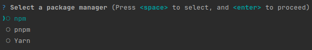

inquirer-radio-prompt
=====================
[](https://github.com/jbenner-radham/inquirer-radio-prompt/actions/workflows/ci.yaml)
[](https://www.npmjs.com/package/inquirer-radio-prompt)
[](https://nodejs.org/)
[](LICENSE)

A radio button prompt for [Inquirer](https://github.com/SBoudrias/Inquirer.js/).



Install
-------
```sh
npm install inquirer-radio-prompt
```

Usage
-----
```js
import radio, { Separator } from 'inquirer-radio-prompt';

const answer = await radio({
    message: 'Select a package manager',
    choices: [
        { name: 'npm', value: 'npm' },
        { name: 'yarn', value: 'Yarn' },
        new Separator(),
        { name: 'pnpm', value: 'pnpm' }
    ]
});
```

### Config

| Property | Type                                    | Required                    | Description                                                                                                                                                                                           |
| -------- |-----------------------------------------|-----------------------------|-------------------------------------------------------------------------------------------------------------------------------------------------------------------------------------------------------|
| message  | `string`                                | yes                         | The question to ask                                                                                                                                                                                   |
| choices  | `Choice[] \| string[]`                  | yes                         | List of the available choices.                                                                                                                                                                        |                                                                                                                                                                       |
| pageSize | `number`                                | no                          | By default, lists of choice longer than 7 will be paginated. Use this option to control how many choices will appear on the screen at once.                                                           |
| loop     | `boolean`                               | no                          | Defaults to `true`. When set to `false`, the cursor will be constrained to the top and bottom of the choice list without looping.                                                                     |
| required | `boolean`                               | no                          | When set to `true`, ensures at least one choice must be selected.                                                                                                                                     |
| validate | `async (Choice[]) => boolean \| string` | no                          | On submit, validate the choices. When returning a string, it'll be used as the error message displayed to the user. Note: returning a rejected promise, we'll assume a code error happened and crash. |
| theme    | [See Theming](#theming)                 | no                          | Customize the look of the prompt.                                                                                                                                                                     |

`Separator` objects can be used in the `choices` array to render non-selectable lines in the choice list. By default, it'll render a line, but you can provide the text as argument (`new Separator('-- Dependencies --')`). This option is often used to add labels to groups within long list of options.

#### `Choice` object

The `Choice` object is typed as:

```ts
type Choice<Value> = {
  value: Value;
  name?: string;
  description?: string;
  short?: string;
  disabled?: boolean | string;
};
```

Here's each property:

- `value`: The value is what will be returned by `await radio()`.
- `name`: This is the string displayed in the choice list.
- `description`: Option for a longer description string that'll appear under the list when the cursor highlight a given choice.
- `short`: Once the prompt is done (press enter), we'll use `short` if defined to render next to the question. By default, we'll use `name`.
- `disabled`: Disallow the option from being selected. If `disabled` is a string, it'll be used as a help tip explaining why the choice isn't available.

Also note the `choices` array can contain `Separator`s to help organize long lists.

`choices` can also be an array of strings, in which case the string will be used both as the `value` and the `name`.


### Theming

You can theme a prompt by passing a `theme` object option. The theme object only needs to include the keys you wish to modify, we'll fall back on the defaults for the rest.

```ts
type Theme = {
  prefix: string | { idle: string; done: string };
  spinner: {
    interval: number;
    frames: string[];
  };
  style: {
    answer: (text: string) => string;
    message: (text: string, status: 'idle' | 'done' | 'loading') => string;
    error: (text: string) => string;
    defaultAnswer: (text: string) => string;
    help: (text: string) => string;
    highlight: (text: string) => string;
    key: (text: string) => string;
    disabledChoice: (text: string) => string;
    description: (text: string) => string;
    renderSelectedChoices: <T>(
      selectedChoices: ReadonlyArray<Choice<T>>,
      allChoices: ReadonlyArray<Choice<T> | Separator>,
    ) => string;
  };
  icon: {
    checked: string;
    unchecked: string;
    cursor: string;
  };
  helpMode: 'always' | 'never' | 'auto';
};
```

#### `theme.helpMode`

- `auto` (default): Hide the help tips after an interaction occurs. The scroll tip will hide after any interactions, the selection tip will hide as soon as a first selection is done.
- `always`: The help tips will always show and never hide.
- `never`: The help tips will never show.

Building
--------
```sh
npm run build
```

Testing
-------
```sh
npm test
```

License
-------
The MIT License. See the [license file](LICENSE) for details.
